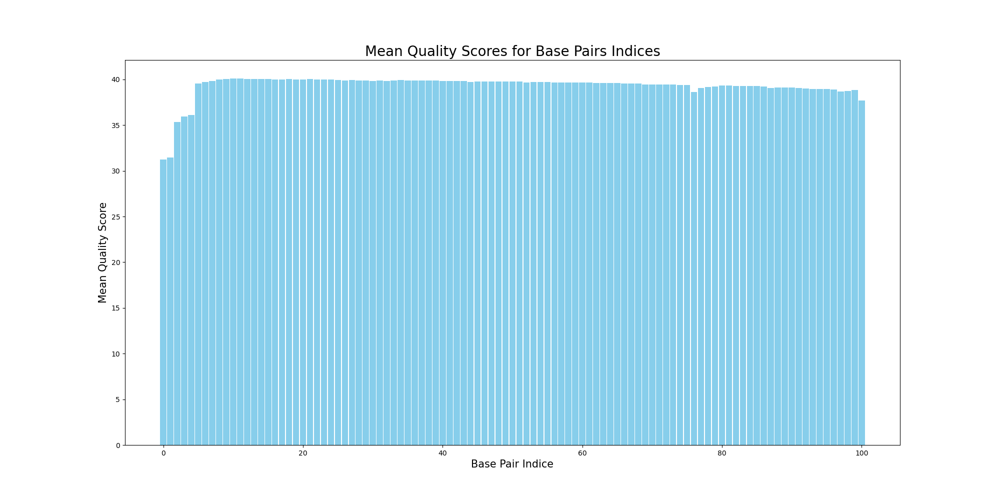
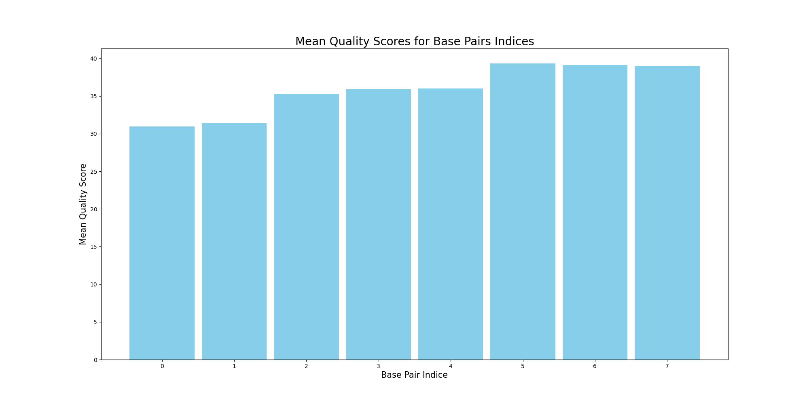
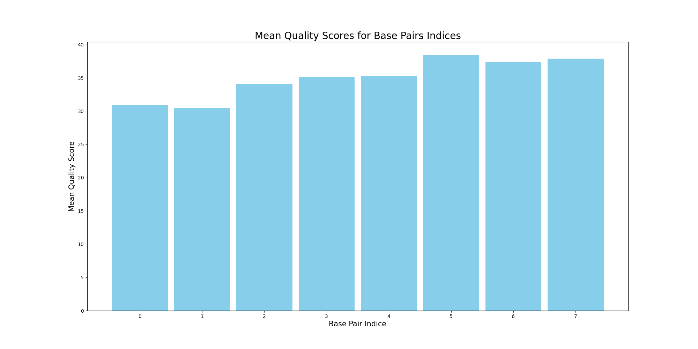
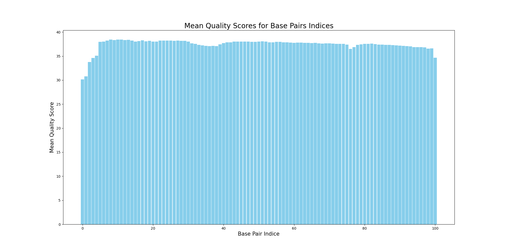

# Assignment the First

## Part 1
1. Be sure to upload your Python script.

| File name | Label | Read length | Phred encoding |
|---|---|---|---|
| 1294_S1_L008_R1_001.fastq.gz | Read 1 | 101 | +33  |
| 1294_S1_L008_R2_001.fastq.gz | Index 1 | 8 | +33 |
| 1294_S1_L008_R3_001.fastq.gz | Index 2 | 8 | +33 |
| 1294_S1_L008_R4_001.fastq.gz | Read 2 | 101 | +33 |

2. Per-base NT distribution
    1. Use markdown to insert your 4 histograms here.
    2. **Read1**
    
    3. **Index1**
    
    4. **Index2**
    
    5. **Read2**
    
    
## Part 2
1. Define the problem

**Multiplexing is when several samples are libraries are run together to take advantage of amassive parallel sequencer. However, the samples need to be demultiplexed to know what sequences are from which samples. Demultiplexing is done by using the unique index or barcode to determine the sample a sequence is associated with. We also need to ensure that the reads have valid matching indexes, and filter out low quality data and data where index hopping occurred. Dual matching indexes allow us to observe when index-hopping occurred, as they won't match (after taking the reverse complement of one index) if it did. Index hopping is an issue especially when looking at samples with low occurrence. We only want to include high quality data so that we have confidence that the sequencing was accurate.**

2. Describe output

**It will output 52 files, 24 for read 1 with matching indexes, 24 for read 2 with matching indexes, 1 for read 1 unmatching indexes, 1 for read 2 unmatching indexes, 1 for read 1 unknown or low quality, and 1 for read2 unknown or low quality. It will return the counts of records for matching indexes, unmatching indexes and unknown or low quality indexes.**

3. Upload your [4 input FASTQ files](../TEST-input_FASTQ) and your [>=6 expected output FASTQ files](../TEST-output_FASTQ).
4. Pseudocode

```
Make a set of 24 known forward indexes.

Open all 4 input FASTQ files, read each line by line. 
    for each record, look at lines 1-4 and save the lines as variables
        check if index1 in known set
        if not in known set
            rev comp index 2, modify header so it has index1 and index2 (modify_header function)
            write to unknown file with write_out function
            increment unknown counter
        if index 1 in known set
            save rev comp of index2 to variable
            check if rev comp index 2 variable in known set
            if rev comp index2 variable not in known set
                modify header so it has index1 and index2 rev comp variable (modify_header function)
                write to unknown file with write_out function
                increment unknown counter
            if in set,
                check if quality score in line 4 for index1 is less than cutoff of 30
                if less than cutoff, 
                    modify header so it has index1 and index2 rev comp (modify_header function)
                    write to unknown file with write_out function
                    increment unknown counter
                check if quality score in line 4 for index2 is less than cutoff of 30, use convert_phred function
                if less than cutoff, 
                    modify header so it has index1 and index2 rev comp (modify_header function)
                    write to unknown file with write_out function
                    increment unknown counter
                check if index1 is equal to rev comp index2 var
                    modify header so it has index1 and index2 rev comp variable (modify_header function)
                    write to matched file with write_out function
                    increment matched counter
                if index1 not equal to rev comp index2 var
                    modify header so it has index1 and index2 rev comp variable (modify_header function)
                    write to unmatched file with write_out function
                    increment unmatched counter```
print out matched counter, unmatched counter, unknown counter


5. High level functions. For each function, be sure to include:
    1. Description/doc string
    2. Function headers (name and parameters)
    3. Test examples for individual functions
    4. Return statement

def convert_phred(letter):
    ```
    Takes in a letter and converts it into a phred score, which is returned.
    ```
    return score


input: 'A' expected output: 32
input: 'F' expected output: 37
input: "@" expected output: 31


def reverse_complement(str):
    ```
    Takes in a string of a sequence, and returns the reverse
    complement of the sequence in a new string.
    ```
    return rev_str


input: 'GTAGCGTA' expected output: 'TACGCTAC'
input: 'TGTTCCGT' expected output: 'ACGGAACA'
input: 'AGAGTCCA' expected output: 'TGGACTCT'


def modify_header(line_1, index_1, index_2)
    ```
    Takes in the first line of the record (the header line)
    and index 1 and index 2. Converts index 2 to its reverse
    complement, and adds index 1 and the reverse compliment of 
    index 2 to the end of the line_1 header. Returns the new header.
    ```
    return labeled_header


input: '@K9403A:27:14', 'AAACTTT', 'AAAGTTT' expected output: '@K9403A:27:14_AAACTTT_AAACTTT'
input: '@K4661:22:17', 'GCATTAC', 'GTAATGC' expected output: '@K4661:22:17_GCATTAC_GCATTAC'
input: '@K45871:45:28', 'CGCGCAT', 'ATGCGCG' expected output: '@K45871:45:28_CGCGCAT_CGCGCAT'


def write_out(filename, line_1, line_2, line_3, line_4):
    ```
    Takes in a filename to write out to, and the
    4 lines of the record that will be written out. 
    Writes out the record to the specificed output file.
    Does not return anything.```


input: 'AA_matched.fq', '@K4661:22:17', '+', 'GCATTAC', '#AAFAAFJJ' expected output: AA_matched.fq with that record in it
path.exists('AA_matched.fq') == True


