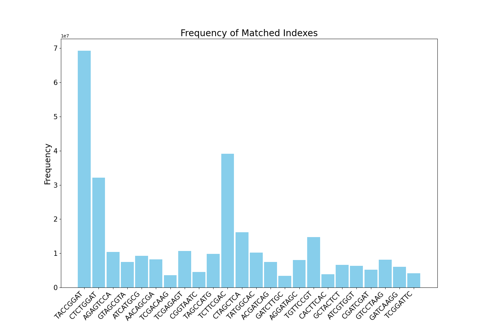

# Demultiplexing Results
**Number of unmatched records:** 517612

**Number of unknown records:** 57748853

**Number of total matched records:** 304980270

**Total Number of Records:** 363246735

## **Read Type Frequency**

## **Index Hopping Frequency**

## **Matched Index Frequency**

## **Percentages of Matched Indexes**

**Unmatched index counts:** {'TATGGCAC': 97103, 'CTAGCTCA': 31880, 'CTCTGGAT': 34554, 'TCGACAAG': 10588, 'TGTTCCGT': 92569, 'TACCGGAT': 55532, 'GATCAAGG': 20717, 'ATCATGCG': 10456, 'GTCCTAAG': 14018, 'TCTTCGAC': 38630, 'CACTTCAC': 7172, 'AGAGTCCA': 9889, 'CGATCGAT': 6368, 'AGGATAGC': 8901, 'TCGGATTC': 5516, 'CGGTAATC': 9848, 'GCTACTCT': 6990, 'TAGCCATG': 7885, 'TCGAGAGT': 11410, 'ACGATCAG': 8142, 'ATCGTGGT': 7218, 'AACAGCGA': 9747, 'GTAGCGTA': 8788, 'GATCTTGC': 3691}

**Matched index counts:** {'TACCGGAT': 69307073, 'CTCTGGAT': 32163349, 'AGAGTCCA': 10378366, 'GTAGCGTA': 7450201, 'ATCATGCG': 9264615, 'AACAGCGA': 8178191, 'TCGACAAG': 3548541, 'TCGAGAGT': 10658212, 'CGGTAATC': 4498136, 'TAGCCATG': 9852258, 'TCTTCGAC': 39149148, 'CTAGCTCA': 16162895, 'TATGGCAC': 10195805, 'ACGATCAG': 7441721, 'GATCTTGC': 3425453, 'AGGATAGC': 8078057, 'TGTTCCGT': 14786868, 'CACTTCAC': 3833640, 'GCTACTCT': 6610857, 'ATCGTGGT': 6357656, 'CGATCGAT': 5225776, 'GTCCTAAG': 8164223, 'GATCAAGG': 6085915, 'TCGGATTC': 4163314}

**Matched index percentages:** {'TACCGGAT': 19.079888770369816, 'CTCTGGAT': 8.854408285321545, 'AGAGTCCA': 2.85711198477806, 'GTAGCGTA': 2.0510028810031837, 'ATCATGCG': 2.550501933623712, 'AACAGCGA': 2.2514148681886983, 'TCGACAAG': 0.9768954977668278, 'TCGAGAGT': 2.9341521817119705, 'CGGTAATC': 1.2383142273804608, 'TAGCCATG': 2.7122770972738404, 'TCTTCGAC': 10.777563630406755, 'CTAGCTCA': 4.449563737992029, 'TATGGCAC': 2.8068538592645575, 'ACGATCAG': 2.0486683796345755, 'GATCTTGC': 0.9430099901655, 'AGGATAGC': 2.2238484813910304, 'TGTTCCGT': 4.070750422574342, 'CACTTCAC': 1.055381819192401, 'GCTACTCT': 1.8199356974261585, 'ATCGTGGT': 1.7502307350401924, 'CGATCGAT': 1.4386298613255257, 'GTCCTAAG': 2.2475695480098397, 'GATCAAGG': 1.6754218038601227, 'TCGGATTC': 1.146139414026667}

