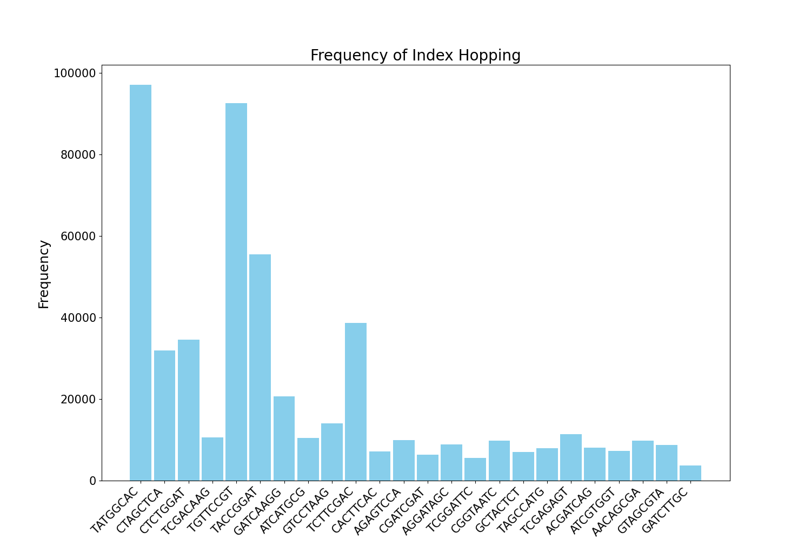
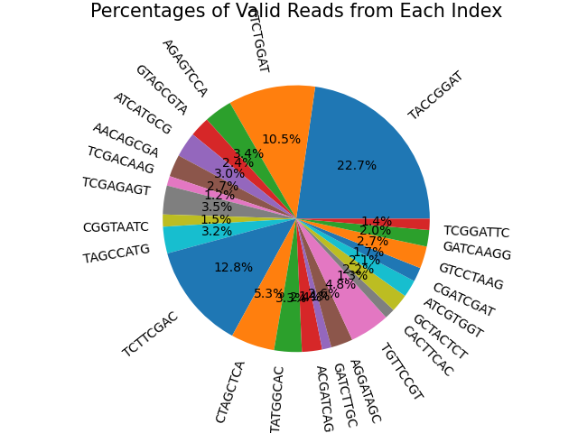

# Demultiplexing Results
**Number of unmatched records:** 517612

**Number of unknown records:** 57748853

**Number of total matched records:** 304980270

**Total Number of Records:** 363246735

## **Read Type Frequency**

## **Index Hopping Frequency**

## **Matched Index Frequency**

## **Percentages of Matched Indexes**

**Unmatched index counts:** {'GATCAAGG': 28066, 'CGGTAATC': 16157, 'TATGGCAC': 192812, 'TAGCCATG': 20535, 'TCGGATTC': 12198, 'GTAGCGTA': 17615, 'TCGACAAG': 27800, 'AACAGCGA': 17929, 'GCTACTCT': 17199, 'AGAGTCCA': 19691, 'CGATCGAT': 14019, 'TACCGGAT': 111390, 'AGGATAGC': 17674, 'GTCCTAAG': 22282, 'ATCATGCG': 26882, 'ACGATCAG': 18369, 'CACTTCAC': 11945, 'ATCGTGGT': 17348, 'CTCTGGAT': 66503, 'CTAGCTCA': 46507, 'TGTTCCGT': 189176, 'TCGAGAGT': 24501, 'TCTTCGAC': 89525, 'GATCTTGC': 9101}

**Matched index counts:** {'GATCAAGG': 6085915, 'CGGTAATC': 4498136, 'TATGGCAC': 10195805, 'TAGCCATG': 9852258, 'TCGGATTC': 4163314, 'GTAGCGTA': 7450201, 'TCGACAAG': 3548541, 'AACAGCGA': 8178191, 'GCTACTCT': 6610857, 'AGAGTCCA': 10378366, 'CGATCGAT': 5225776, 'TACCGGAT': 69307073, 'AGGATAGC': 8078057, 'GTCCTAAG': 8164223, 'ATCATGCG': 9264615, 'ACGATCAG': 7441721, 'CACTTCAC': 3833640, 'ATCGTGGT': 6357656, 'CTCTGGAT': 32163349, 'CTAGCTCA': 16162895, 'TGTTCCGT': 14786868, 'TCGAGAGT': 10658212, 'TCTTCGAC': 39149148, 'GATCTTGC': 3425453}

**Matched index percentages:** {'GATCAAGG': 1.6754218038601227, 'CGGTAATC': 1.2383142273804608, 'TATGGCAC': 2.8068538592645575, 'TAGCCATG': 2.7122770972738404, 'TCGGATTC': 1.146139414026667, 'GTAGCGTA': 2.0510028810031837, 'TCGACAAG': 0.9768954977668278, 'AACAGCGA': 2.2514148681886983, 'GCTACTCT': 1.8199356974261585, 'AGAGTCCA': 2.85711198477806, 'CGATCGAT': 1.4386298613255257, 'TACCGGAT': 19.079888770369816, 'AGGATAGC': 2.2238484813910304, 'GTCCTAAG': 2.2475695480098397, 'ATCATGCG': 2.550501933623712, 'ACGATCAG': 2.0486683796345755, 'CACTTCAC': 1.055381819192401, 'ATCGTGGT': 1.7502307350401924, 'CTCTGGAT': 8.854408285321545, 'CTAGCTCA': 4.449563737992029, 'TGTTCCGT': 4.070750422574342, 'TCGAGAGT': 2.9341521817119705, 'TCTTCGAC': 10.777563630406755, 'GATCTTGC': 0.9430099901655}